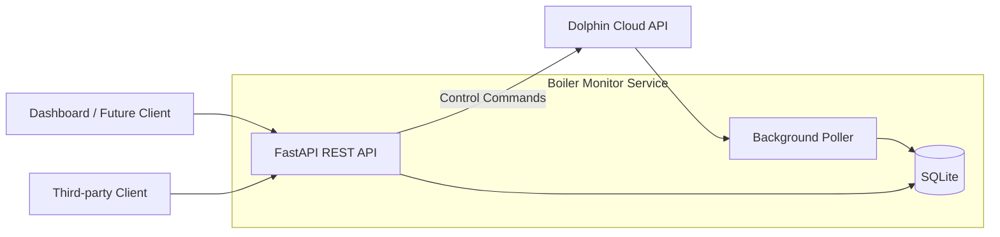
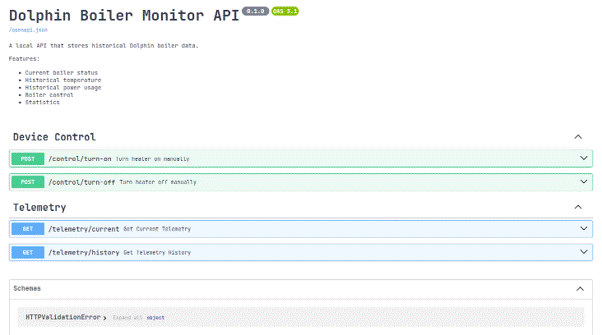

[](https://github.com/<lgidon/Dolphin_Boiler_Monitor/actions)
[](https://coveralls.io/github/lgidon/Dolphin_Boiler_Monitor?branch=dev)

<picture><source media="(prefers-color-scheme: dark)" srcset="https://www.shieldcn.dev/github/license/lgidon/Dolphin_Boiler_Monitor.svg?variant=ghost&amp;size=xs&amp;mode=dark&amp;font=geist"></picture>

[](https://github.com/astral-sh/ruff)
[](https://github.com/astral-sh/uv)


## Why This Project Exists

The official Dolphin app comes with several notable limitations for home automation enthusiasts and multi-device users:

- _Mobile-Only Restriction_: The official application is strictly confined to mobile devices, leaving out direct control options from PCs, laptops, or non-Android/Apple tablets.

- _Limited Historical Analytics_: The native app provides very rudimentary tools for viewing past readings, making it difficult to analyze long-term temperature trends or heater efficiency.

- _Lack of Integration_: The system lacks built-in pathways for easily connecting and automating the boiler alongside other smart home platforms and devices.

## Features

- **Background Telemetry Polling**: Asynchronously queries heater status on a regular interval and logs readings to a persistent SQLite database.

- **Database Persistence & Concurrency**: Utilizes SQLAlchemy with aiosqlite and enables SQLite WAL mode for improved read/write throughput.

- **Manual Control Endpoints**: Send remote commands to manually turn the boiler on or off.

- **Telemetry Query Endpoints**: Retrieve the latest live status (/telemetry/current) or query historical logs over configurable time windows (/telemetry/history).

- **Resilient Error Handling**: Gracefully handles transient API errors and recovers without crashing the background worker loop.

## Tech Stack

- **Language**: Python (Preferred)

- **Web Framework**: FastAPI & Uvicorn

- **Database**: SQLite via SQLAlchemy (Async ORM)

- **Testing**: Pytest, Pytest-Asyncio, and Respx (for mocking HTTP calls)

- **Package Management**: uv

## Project Structure

```
Dolphin_Boiler_Monitor/
├── app/
│   ├── __init__.py
│   ├── main.py              # FastAPI app initialization, lifespan, & background loop
│   ├── client.py            # External Dolphin API client
│   ├── database.py          # SQLAlchemy async engine, sessionmaker, & init_db
│   ├── main.py              # App Entry point
│   ├── models.py            # Pydantic schemas/models
│   ├── poller.py            # Polling logic for fetching and saving telemetry
│   ├── sql_models.py        # SQLAlchemy ORM models (TelemetryLog)
│   └── routers/
│       ├── control.py       # Turn on/off control endpoints
│       └── telemetry.py     # Current & historical telemetry query endpoints
├── tests/
│   ├── test_routers.py      # Control endpoint tests
│   ├── test_poller.py       # Polling process tests
│   ├── test_client.py       # Dolphin API access test
│   └── test_telemetry.py    # Telemetry database & endpoint tests
└── pyproject.toml
```

## Architecture



The monitor separates telemetry collection from control operations. Historical and current status are served from the local database, while control requests are forwarded directly to the Dolphin Cloud API. This ensures low-latency command execution while keeping telemetry collection independent and resilient.

#### Swagger UI:



## Getting Started

### Prerequisites

- **Python**: `3.10` or higher
- **uv**: Fast Python package installer and resolver ([Installation Guide](https://github.com/astral-sh/uv#installation))

### Installation & Setup

1. Clone this repository and navigate into the project directory:

2. Install dependencies using uv:

   ```Bash
   uv sync
   ```

3. Configure environment variables:

- Copy the example environment file:

  ```Bash
  cp .env.example .env
  ```

- Retrieve your Dolphin API key using `curl` (replace with your account credentials) or Postman:
  ```bash
  curl --location 'https://api.dolphinboiler.com/HA/V1/getAPIkey.php' \
    --form 'email="your_email@example.com"' \
    --form 'password="your_password"'
  ```
- Open the newly created `.env` file and populate it with your credentials and the returned API key:

  ```env
  DOLPHIN_BASE_URL="https://api.dolphinboiler.com/HA/V1" #Leave this value
  DOLPHIN_EMAIL="your_email@example.com"
  DOLPHIN_DEVICE_NAME="your_device_name"
  DOLPHIN_API_KEY="your_retrieved_api_key"

  # Optional: Background polling interval in seconds (default: 120.0)
  POLL_INTERVAL_SECONDS=120.0
  ```

## Running the Application

- Start the development server with live reload enabled:

  ```Bash
  uv run uvicorn app.main:app --reload
  ```

* API Docs (Swagger UI): Open [http://127.0.0.1:8000/docs](http://127.0.0.1:8000/docs) in your browser.

* Interactive ReDocs: Open [http://127.0.0.1:8000/redoc](http://127.0.0.1:8000/redoc).

## API Endpoints

### Control Endpoints (/control)

- POST /control/turn-on: Manually turn on the boiler with a specified target temperature.

- POST /control/turn-off: Manually turn off the boiler.

### Telemetry Endpoints (/telemetry)

- GET /telemetry/current: Fetch the single most recent polled heater state.

- GET /telemetry/history: Fetch historical logs with optional parameters:
  - hours: Time window to look back (default: 24, range: 1 to 168).

  - limit: Maximum number of records to return (default: 100, range: 1 to 1000).

## Running Tests

- Execute the test suite using pytest:

  ```Bash
  uv run pytest
  ```

- To run a test on the live Dolphin API:

  ```Bash
  uv run pytest -m live
  ```

## Continuous Integration & Quality Checks

This project uses **GitHub Actions** to automatically run code quality checks and test suites on every `push` and prevents `pull_request` to the `main` branch until everything passes:

- **Automated Testing**: Executes the `pytest` test suite against Python 3.10+ environments.

- **Linting & Code Style**: Uses **Ruff** for ultra-fast Python linting, formatting, and import sorting.

### Running Quality Checks Locally

Before committing changes, you can run the exact same checks locally:

```bash
# Run pytest test suite
uv run pytest

# Check code for linting issues
uv run ruff check .

# Check code formatting
uv run ruff format --check .
```

## Development & Branching Workflow

To maintain code quality and stability on `main`, the project enforces a structured git workflow using GitHub Actions:

1. **Development Branching**: All new features and bug fixes must be developed on the `dev` branch (or feature branches created off `dev`). Direct pushes to `main` are strictly restricted.
2. **Automated Verification**: When code is pushed to `dev`, GitHub Actions automatically executes:
   - The `pytest` test suite.
   - `ruff` linting and formatting validation.
3. **Pull Request Policy**: Merging into `main` requires creating a Pull Request from `dev`. A PR can only be merged when:
   - All automated tests, linting, and formatting checks pass.
   - The code review is explicitly approved by the repository maintainer.
